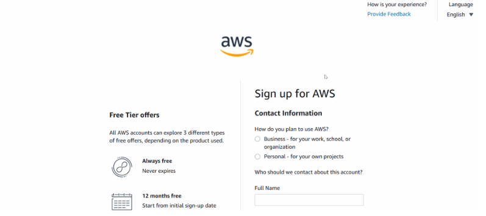
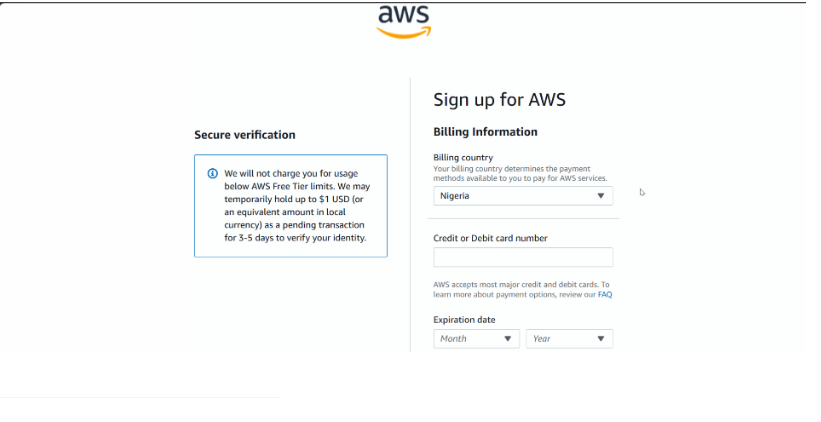
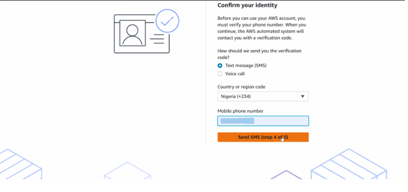

# AWS Free Tier Account Registration Guide

This guide provides step-by-step instructions on how to register for the Amazon Web Services (AWS) Free Tier.  The AWS Free Tier lets you explore cloud computing at no cost with limited resources, such as 750 hours of EC2 compute and 5 GB of S3 storage.  Follow the instructions below to create your account.

## Prerequisites

Before you start, make sure you have the following:

- **Email address** – You’ll need a valid email that you check regularly because AWS sends verification and billing alerts.
- **Credit or debit card** – AWS uses your card to verify your identity and may place a temporary hold of around US$1 for three to five days.
- **Phone number** – AWS sends a verification code by text message or voice call during the sign‑up process.

## Steps to create your AWS Free Tier account

### 1. Start the sign‑up process

Go to the AWS home page：https://aws.amazon.com/cn/ and click **Create Account** in the upper‑right corner.  If you are taken to the sign‑in page instead, scroll down and click **New to AWS? Sign up** to reach the registration form.

### 2. Verify your email and choose an account name

On the sign‑up page, enter a **root‑user email address** and **choose a name** for your AWS account.  AWS will send a verification code to your email; click **Verify email address**, complete the CAPTCHA and enter the code.  You will then set a secure password—the password must be at least eight characters long and include a mix of numbers, uppercase and lowercase letters, and symbols.

### 3. Provide your contact information

Choose **Personal** as the account type if you’re signing up for learning or personal projects.  Then fill in your **full name**, **phone number (with country code)**, **address** and **postal code**.  Check the box indicating that you agree to the AWS Customer Agreement.

### 4. Add billing information

Enter your **billing country**, **credit or debit card details** and **billing address**.  AWS temporarily holds around US$1 (or the equivalent in your local currency) to confirm your card is valid.  Click **Verify and continue** to proceed.

### 5. Verify your identity by phone

AWS asks you to verify your identity by sending a code to your phone.  Choose whether to receive the code via **SMS** or **voice call**, enter your country code and phone number, and click **Send SMS** or **Call me**.  Complete the CAPTCHA, enter the code you receive and click **Verify and continue**.

If AWS reports a problem with your payment information, double‑check that:

- Your card type is accepted.
- The billing name and address match your card issuer.
- At least US$1 is available for the temporary hold.

### 6. Choose a support plan

AWS prompts you to select a support plan.  Select **Basic Support (Free)**, which is recommended for new users.  The free plan still grants you access to the Free Tier and its included services.

### 7. Sign in to the AWS Management Console

After your account is set up and verified, sign in to the **AWS Management Console**.  It may take a few hours for your account to become fully active.  Once signed in, you can launch virtual servers (EC2), store data in S3 and explore the many services included in the Free Tier.

## Additional tips

- The sign‑up process requires an email address, a credit card and a phone number.
- Enable **multi‑factor authentication (MFA)** on your root account, and create a separate **IAM user** for everyday tasks.
- Turn on **billing alerts** so you’re notified if your monthly bill approaches or exceeds the Free Tier limits.

Congratulations!  You now have an AWS Free Tier account.  Use the console to experiment with cloud services, build projects and learn more about AWS.

