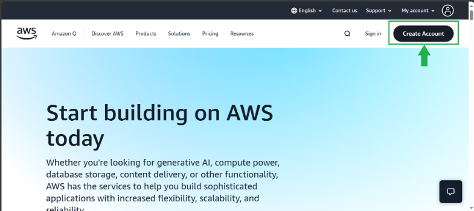
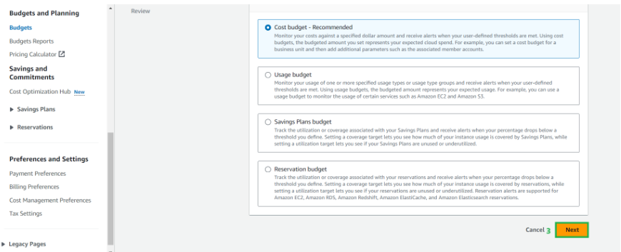
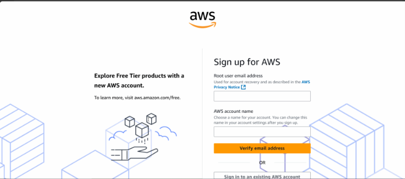

# Creating a Monthly Cost Budget ($50) in AWS

This guide walks you through creating an AWS **Cost Budget** that restricts your monthly spending to **US $50**. AWS Budgets let you track your spending and receive alerts when your usage or forecast exceeds a threshold. The instructions below use the **Customize (advanced)** workflow and include real screenshots (not animations) so that you can follow along easily.

## Prerequisites

Before you begin, sign in to the **AWS Management Console** as an account administrator or a user with permission to create budgets. Navigate to **AWS Billing and Cost Management** from the services search bar and select **Budgets** in the left navigation pane.

## Step‑by‑Step Instructions

### 1. Open the Budgets page

On the Budgets page, click **Create budget** to start a new budget. This takes you to the budget setup workflow.

### 2. Choose the advanced cost budget type

In the **Budget setup** step, select **Customize (advanced)** to access all budget options. Under **Budget types**, choose **Cost budget**, then click **Next**.

After selecting **Cost budget**, confirm the type and click **Next**.

### 3. Set your budget details

In the **Set your budget** step, configure the budget period and amount:

- **Budget name:** Give your budget a descriptive name (e.g., **Monthly Cost Budget**).
- **Period:** Choose **Monthly** to track spending each month.
- **Budget effective dates:** Select **Recurring budget** so the budget renews every month.
- **Budgeted amount:** Choose **Fixed** and enter **50** (or the equivalent in your currency) as the amount.

After entering these details, click **Next**.

### 4. Define the budget scope

On the **Budget scope** step, leave the default **All AWS services** to monitor overall spending, or apply optional filters (e.g., specific services, accounts or tags) for more granular control. Then click **Next**.

### 5. Add an alert threshold

In the **Configure alerts** step, click **Add an alert threshold**. Specify when AWS should notify you—for example, set a threshold at **80 % of actual spend** or **80 % of forecasted spend**. Add one or more email recipients who should receive budget alerts and optionally configure an Amazon SNS topic for programmatic notifications. Click **Next** when done.

### 6. Configure alert details

On the alert configuration page, adjust the threshold percentage and confirm the notification settings. Ensure that your budget amount remains at **US $50** and that you will receive alerts before costs exceed this limit.

### 7. Review budget actions and create the budget

AWS Budgets allows you to configure automated **Budget actions**—for example, to apply an IAM policy or stop EC2 or RDS instances when a threshold is reached. Review these settings, then click **Next** to proceed. Finally, review your budget configuration and click **Create budget**.

### 8. Confirm that your budget was created

After clicking **Create budget**, AWS displays a confirmation message indicating that your budget has been created successfully. You can now see the budget on the Budgets page and will receive alerts if your monthly spending approaches or exceeds **$50**.

## Tips and Notes

- **Threshold values:** Adjust the alert threshold to your preference. Setting the threshold at 80 % gives you advance notice before reaching your budgeted amount.
- **Spending delay:** AWS Budgets updates every 8–12 hours. There may be a delay between when costs are incurred and when alerts are triggered. Conservative thresholds can help compensate for this delay.
- **Scopes and filters:** You can filter budgets by services, linked accounts, tags or cost categories for more targeted monitoring.

By following these steps and using the real screenshots above, you can set up a monthly cost budget in AWS to keep your spending under **$50**.

