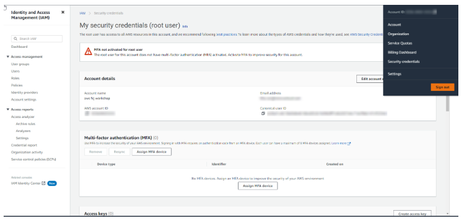
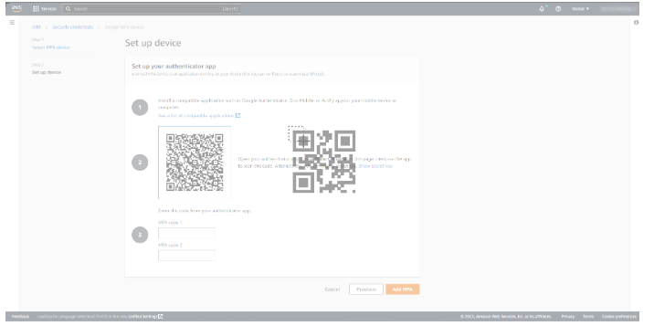
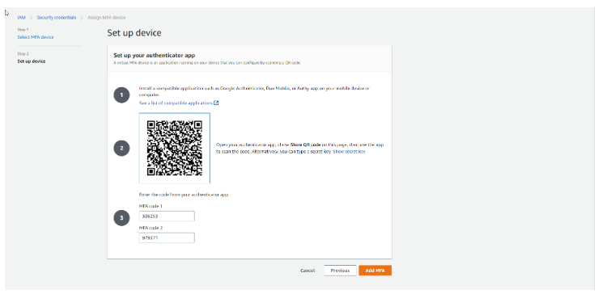

# AWS Multi-Factor Authentication (MFA) Setup: Duo Mobile and Security Key

Securing your Amazon Web Services (AWS) account is critical.  Multi‑factor authentication (MFA) helps protect your account by requiring a second form of verification in addition to your password.  This guide walks you through adding **two MFA methods**: a virtual device using the **Duo Mobile** authenticator app and a **hardware security key (U2F/FIDO)**.  Using two different MFA methods provides redundancy—if one device isn’t available, you can still log in using the other.

## Prerequisites

Before you begin, make sure you have the following:

- **AWS root user or IAM user credentials**.  You need permission to manage MFA devices.
- **Smartphone with Duo Mobile** (or any compatible authenticator app) installed.
- **Hardware security key** (e.g., YubiKey, Titan Security Key) that supports U2F/FIDO.

## Part 1 – Enable a Virtual MFA Device (Duo Mobile)

### 1. Open *My Security Credentials*

1. Sign in to the AWS Management Console.  In the upper‑right corner, click your account name and select **My Security Credentials**.
2. On the *Security Credentials* page, expand **Multi‑factor authentication (MFA)** and click **Assign MFA**.

### 2. Choose **Authenticator App**

1. In the **Select MFA Device** interface, enter a device name (e.g., `Duo Mobile`).
2. Select **Authenticator App** as the MFA device type, then click **Next**.

### 3. Set up the authenticator app

1. AWS prompts you to install a compatible authenticator app.  You can use **Duo Mobile** (recommended), Google Authenticator or Authy.
2. Click **Show QR code** on the AWS page.  Open Duo Mobile on your phone and choose to add a new account.  Scan the QR code displayed in AWS.
3. After scanning, Duo Mobile will generate six‑digit codes.  Enter the first code into **MFA code 1** and the second code into **MFA code 2**, then select **Add MFA**.

The following screenshots illustrate the process of showing the QR code and entering the two generated codes:

Once completed, AWS will confirm that your virtual MFA device has been added.

## Part 2 – Enable a Hardware Security Key

After adding the virtual MFA device, you can add a second MFA method to the same account.  Using a hardware security key provides a strong, phishing‑resistant second factor.

### 1. Return to My Security Credentials

1. From the AWS console, click your account name again and choose **My Security Credentials**.
2. Expand **Multi‑factor authentication (MFA)** and click **Assign MFA**.

### 2. Select **Security key**

1. In the **Manage MFA Device** interface, select **Security key** (also labelled U2F/FIDO) and click **Continue**.
2. When prompted, insert your hardware security key into a USB port and follow the browser prompts to register it.
3. After the registration is complete, AWS shows a confirmation screen.  Click **Close** or **Add MFA** to finish.

> **Tip:** You can register multiple security keys for redundancy.

## Using MFA at Login

When signing in to AWS after configuring multiple MFA methods, AWS will prompt you to select an MFA device.  Choose **Duo Mobile** to receive a time‑based code from your phone, or select your **security key** to authenticate via the USB key.  Having both methods ensures you can still access your account if your phone is unavailable or your security key is misplaced.

## Summary

By setting up both a virtual MFA device (with Duo Mobile) and a hardware security key, you add multiple layers of protection to your AWS account.  This dual‑method MFA approach helps ensure that even if one method fails or is lost, you have another way to verify your identity and access your AWS resources.
